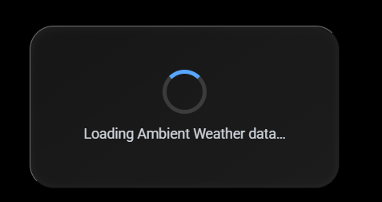
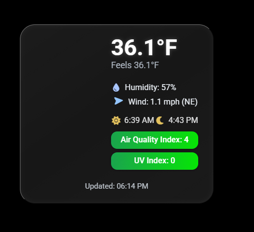

# 🧊 MMM-AmbientWeather

A modern, real-time Ambient Weather display module for MagicMirror²
 featuring liquid-glass UI, 3D animated weather icons, dynamic AQI and UV gradients, and realtime data streaming via the Ambient Weather Realtime API.

<p align="center">   </p>

## ✨ Features

🔄 Realtime weather updates via Ambient Weather’s Realtime API

🌤️ Full-color 3D animated icons for day/night and all major weather types

💧 Displays temperature, feels-like, humidity, windspeed + direction

🌬️ 3D rotating weathervane with compass text (N, NNE, NE, …)

⚡ Rain and lightning detection badges (based on station data)

☀️ Sunrise and sunset times (computed automatically)

🌫️ Dynamic AQI and UV Index badges with linear color gradients

🧊 Liquid-glass frosted card UI with raised beveled edge

✨ Subtle particle shimmer animation on the background for realism

🔕 Offline fallback — card fades and shows last update if stale

🧭 Supports both Imperial and Metric units

## 🧩 Installation

Navigate to your MagicMirror modules directory:

```
cd ~/MagicMirror/modules
```


Clone this repository:

```
git clone https://github.com/hearter20176/MMM-AmbientWeather.git
```


Install dependencies:

```
cd MMM-AmbientWeather
npm install
```


(Optional) Create the animations folder if not present:

```
mkdir animations
```


Then place your Lottie JSON weather animations inside.
Example filenames:

```js
clear_day.json
clear_night.json
partly_cloudy_day.json
rain.json
thunderstorm.json
...
```


Add the module to your MagicMirror ```config.js``` file (see below).

## ⚙️ Configuration

Add the following to your ```config/config.js```:

```js
  {
  module: "MMM-AmbientWeather",
  position: "top_right",
  config: {
    title: "Home Weather",
    useNodeHelper: true,
    apiKey: "YOUR_API_KEY_HERE",
    applicationKey: "YOUR_APP_KEY_HERE",
    macAddress: "xx:xx:xx:xx:xx:xx",
    units: "imperial",           // "imperial" or "metric"
    showIndoor: true,
    showUV: true,
    showSunTimes: true,
    showBarometer: true,
    pressureTrendThreshold: 0.01,
    latitude: 40.7128,           // optional fallback
    longitude: -74.0060,
    showNwsForecast: true,
    forecastDays: 3,
    forecastCacheMinutes: 90,
    updateInterval: 30000,       // milliseconds
    offlineThreshold: 300000,    // fade card if no update after 5 min
    animateIcons: true,
    performanceProfile: "auto",  // "auto" | "pi" | "full"
    reduceMotion: false          // true disables Lottie on low-power or reduced-motion setups
  }
}
```

Note: For the weather.gov forecast API, keep `latitude` and `longitude` to 4 decimal places or fewer. More precision can cause the API to reject the request.

## 🛠️ Options

| Option             | Type      | Default          | Description                                    |
| :----------------- | :-------- | :--------------- | :--------------------------------------------- |
| `title`            | `string`  | `"Home Weather"` | Optional title for the card.                   |
| `apiKey`           | `string`  | **Required**     | Your Ambient Weather API key.                  |
| `applicationKey`   | `string`  | **Required**     | Your Ambient Weather app key.                  |
| `macAddress`       | `string`  | **Required**     | MAC address of your station.                   |
| `units`            | `string`  | `"imperial"`     | `"imperial"` or `"metric"`.                    |
| `showIndoor`       | `boolean` | `true`           | Show indoor temperature/humidity.              |
| `showAQI`          | `boolean` | `true`           | Display Air Quality Index badge.               |
| `showUV`           | `boolean` | `true`           | Display UV Index badge.                        |
| `showSunTimes`     | `boolean` | `true`           | Show sunrise/sunset times.                     |
| `latitude`         | `float`   | —                | Fallback location if device lacks coordinates. |
| `longitude`        | `float`   | —                | Fallback location if device lacks coordinates. |
| `updateInterval`   | `int`     | `30000`          | Refresh interval (milliseconds).               |
| `offlineThreshold` | `int`     | `300000`         | Time until module grays out when data stale.   |
| `animateIcons`     | `boolean` | `true`           | Enable Lottie animated weather icons.          |
| `animations`       | `object`  | (JSON map)       | Map of weather types to animation filenames.   |
| `performanceProfile` | `string` | `"auto"`        | `"auto"` detects Pi/ARM to lower motion, `"pi"` forces low-motion, `"full"` keeps all effects. |
| `reduceMotion`     | `boolean` | `false`          | Force-disable Lottie/motion (also triggered by `prefers-reduced-motion`). |
| `debug`            | `boolean` | `false`          | Log every realtime payload from the Ambient API (verbose; off by default). |

## 🌈 Data Displayed

Temperature (°F/°C)

Feels like

Humidity (%)

Windspeed (mph/kmh) + Weathervane

Air Quality Index (0–500 gradient: green → red)

UV Index (0–11 gradient: green → red)

Sunrise / Sunset

Rain and Lightning detection

Offline indicator / last updated

## 🪩 Visual Effects

Liquid Glass Card:
A translucent, frosted background with blur, bevel, and raised border.

Shimmer Animation:
A subtle looping reflection moving across the card surface.

3D Lottie Weather Icons:
Crisp animated illustrations for all major weather types.

Color-coded AQI & UV badges:
Smooth gradient transitions based on live values.

Offline Mode:
The card fades and becomes grayscale when no data >5 min.

## 🧭 Example Screens

| Condition        | Preview                     |
| ---------------- | --------------------------- |
| Day - Clear      |    |
| Night - Cloudy   |  |
| Rain & Lightning |   |

## 🧰 Dependencies

MagicMirror²

```js
ambient-weather-api
```

```js
bodymovin
``` 
(Lottie)

```js
suncalc
```

## 🧑‍💻 Credits

Author: Harry Arter

Realtime Data: [Ambient Weather API](https://ambientweather.net/)

Animations: [LottieFiles.com]https://lottiefiles.com/

UI Design Inspiration: iOS “Liquid Glass” & weather dashboard aesthetics

## 🪪 License

This module is released under the [MIT License](LICENSE).

Feel free to fork, enhance, and share improvements!

## Local Lottie

This module ships with a local copy of `vendor/lottie.min.js` to avoid CDN/network blocking. No CDN fetch is needed at runtime.
