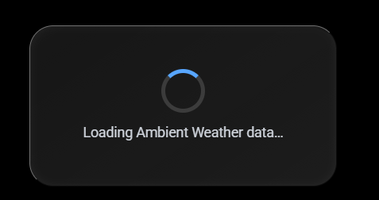
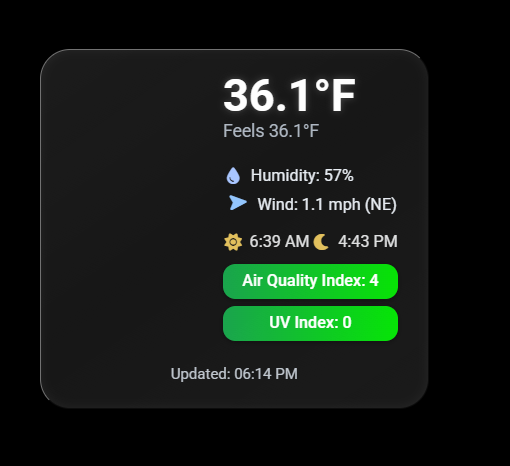

# MMM-AmbientWeather

A real-time Ambient Weather display module for MagicMirror2, featuring a liquid-glass UI, Lottie
weather icons (with a static icon fallback for low-power devices), and realtime data streaming via
the Ambient Weather Realtime API.

<p align="center">
  
  
</p>

## Features

- Realtime weather updates via Ambient Weather's Realtime API (socket.io)
- Animated Lottie icons for day/night and all major weather types, with static Font Awesome icon
  fallback when animation is disabled (e.g. on `performanceProfile: "pi"`)
- Temperature, feels-like, humidity, windspeed + direction, indoor temperature/humidity
- Rotating weathervane with compass text (N, NNE, NE, ...)
- Rain and lightning detection badges (based on station data)
- Sunrise and sunset times (computed automatically via SunCalc when the station doesn't report them)
- UV Index, shown as an animated icon or a plain number when Lottie is disabled
- 3-day (configurable) National Weather Service forecast panel
- Liquid-glass frosted card UI
- Offline fallback - card fades and shows last update time if data goes stale
- Visible error state (missing/invalid API keys, connection failure, wrong `macAddress`) instead of
  an indefinite loading spinner
- Supports both Imperial and Metric units

## Installation

Navigate to your MagicMirror modules directory:

```sh
cd ~/MagicMirror/modules
```

Clone this repository:

```sh
git clone https://github.com/hearter20176/MMM-AmbientWeather.git
```

Install dependencies:

```sh
cd MMM-AmbientWeather
npm install
```

Add the module to your MagicMirror `config.js` file (see below).

## Configuration

Add the following to your `config/config.js`:

```js
{
  module: "MMM-AmbientWeather",
  position: "top_right",
  config: {
    title: "Home Weather",
    apiKey: "YOUR_API_KEY_HERE",
    applicationKey: "YOUR_APP_KEY_HERE",
    macAddress: "xx:xx:xx:xx:xx:xx",
    units: "imperial",           // "imperial" or "metric"
    showUV: true,
    showSunTimes: true,
    showBarometer: true,
    pressureTrendThreshold: 0.01,
    latitude: 40.7128,           // used for sunrise/sunset fallback and the NWS forecast
    longitude: -74.0060,
    showNwsForecast: true,
    forecastDays: 3,
    forecastCacheMinutes: 90,
    offlineThreshold: 300000,    // fade card if no update after 5 min
    animateIcons: true,
    performanceProfile: "auto",  // "auto" | "pi" | "full"
    reduceMotion: false,         // true disables Lottie on low-power or reduced-motion setups
    minWidth: 260
  }
}
```

Note: For the weather.gov forecast API, keep `latitude` and `longitude` to 4 decimal places or
fewer. More precision can cause the API to reject the request.

## Options

| Option                  | Type      | Default          | Description                                                                                     |
| :----------------------- | :-------- | :--------------- | :------------------------------------------------------------------------------------------------ |
| `title`                  | `string`  | `"Home Weather"` | Title shown at the top of the card. Set to `""`/`false` to hide.                                  |
| `apiKey`                 | `string`  | **Required**     | Your Ambient Weather API key.                                                                      |
| `applicationKey`         | `string`  | **Required**     | Your Ambient Weather application key.                                                              |
| `macAddress`             | `string`  | —                 | MAC address of your station. If omitted, the first device on the account is used.                 |
| `units`                  | `string`  | `"imperial"`     | `"imperial"` or `"metric"`. Applies to temperature (F/C) and wind speed (mph/km/h).                |
| `showUV`                 | `boolean` | `true`           | Show the UV Index (animated icon, or a number when Lottie is disabled).                            |
| `showSunTimes`           | `boolean` | `true`           | Show sunrise/sunset times.                                                                          |
| `showBarometer`          | `boolean` | `true`           | Show barometric pressure and its rising/falling/steady trend.                                      |
| `pressureTrendThreshold` | `float`   | `0.01`           | inHg delta between readings required to flag a rising/falling pressure trend.                      |
| `latitude`               | `float`   | —                 | Used for sunrise/sunset fallback (if the station doesn't report it) and the NWS forecast.          |
| `longitude`              | `float`   | —                 | See `latitude`.                                                                                     |
| `showNwsForecast`        | `boolean` | `true`           | Show the National Weather Service forecast panel (requires `latitude`/`longitude`).                |
| `forecastDays`           | `int`     | `3`              | Number of forecast days to request/display (1-5).                                                   |
| `forecastCacheMinutes`   | `int`     | `90`             | Minutes to cache the NWS forecast response before re-fetching.                                      |
| `offlineThreshold`       | `int`     | `300000`         | Milliseconds since the last realtime packet before the module grays out ("offline").                |
| `animateIcons`           | `boolean` | `true`           | Enable Lottie animated weather icons.                                                               |
| `animations`             | `object`  | (JSON map)       | Map of weather condition keys to `{ day, night }` Lottie filenames (under `animations/`).           |
| `performanceProfile`     | `string`  | `"auto"`         | `"auto"` detects Pi/ARM devices and disables Lottie for them, `"pi"` forces it off, `"full"` keeps it on. |
| `reduceMotion`           | `boolean` | `false`          | Force-disable Lottie/motion (also triggered by `prefers-reduced-motion`).                           |
| `minWidth`               | `int`     | `260`            | Minimum card width in pixels.                                                                       |
| `debug`                  | `boolean` | `false`          | Log every realtime payload from the Ambient API to the browser console (verbose; off by default).  |

When `animateIcons` is off (directly, via `reduceMotion`, or because `performanceProfile` resolved
to `"pi"`), the module falls back to static Font Awesome icons for the main condition and each
forecast day, and shows the UV Index as a plain number instead of an animated icon.

## Data Displayed

- Temperature (deg F/C) and feels-like
- Humidity (%)
- Windspeed (mph/km/h) + weathervane with compass direction
- Indoor temperature/humidity (when reported by the station)
- Barometric pressure and trend
- UV Index (0-11)
- Sunrise / sunset
- Rain and lightning detection badges
- National Weather Service forecast (when `showNwsForecast` is enabled)
- Offline indicator / last updated time
- Error state for missing/invalid API keys, connection failures, or an unmatched `macAddress`

## Visual Effects

**Liquid Glass Card**: a translucent, frosted background with blur, bevel, and raised border.

**Shimmer Animation**: a subtle looping reflection moving across the card surface.

**Lottie Weather Icons**: animated illustrations for all major weather types, replaced by static
Font Awesome icons when Lottie is disabled.

**Offline Mode**: the card fades and becomes grayscale when no data has arrived for more than
`offlineThreshold` milliseconds.

## Dependencies

- MagicMirror2
- [socket.io-client](https://www.npmjs.com/package/socket.io-client) - realtime connection to the Ambient Weather API
- [suncalc](https://www.npmjs.com/package/suncalc) - sunrise/sunset fallback when the station doesn't report them
- A vendored copy of [Lottie](https://airbnb.io/lottie/) (`vendor/lottie.min.js`) for icon animation - no CDN fetch required

## Credits

Author: Harry Arter

Realtime Data: [Ambient Weather API](https://ambientweather.net/)

Forecast Data: [National Weather Service API](https://www.weather.gov/documentation/services-web-api)

Animations: [LottieFiles.com](https://lottiefiles.com/)

UI Design Inspiration: iOS "Liquid Glass" and weather dashboard aesthetics

## License

This module is released under the [MIT License](LICENSE).

Feel free to fork, enhance, and share improvements.
